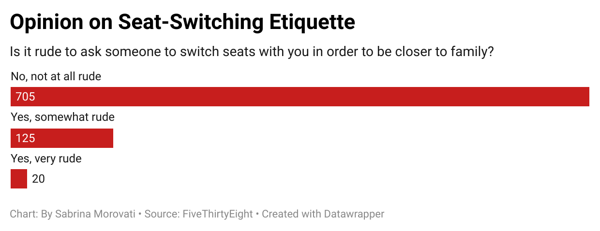

# Opinion-on-Seat-Etiquette

## Flight Etiquette Data

I picked the question *"Is it rude to ask someone to switch seats to be closer to your family?"* because I feel as though this is a question I ask all the time when I am on flights. I never thought it was a rude question to ask, as long as you go about it politley, and I was curious what other peoples' opinion was on the matter. The chart below shows the number of individuals who answered "No, not at all rude," which was 705 individuals, "Yes, somewhat rude," which was 125 individuals and "Yes, very rude," which was 20 individuals. I found it really interesting that 125 people thought it was somewhat rude and that 20 people thought it was incredibly rude, when I don't find a problem with it. 

